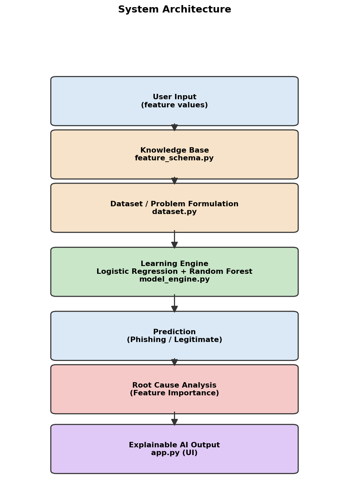

# AI Phishing Detection & Root Cause Analysis

A Machine-Learning prototype with **Explainable AI**, implementing the core pipeline of the paper *"AI-Based Phishing Detection Using Machine Learning and Root Cause Analysis."*



---

## Student Details

| Field | Detail |
|---|---|
| **Name** | T.P. Hettiarachchi |
| **Student ID** | CS/2020/042 |
| **Department** | Computer Science, Faculty of Computing and Technology |
| **University** | University of Kelaniya |
| **Assignment** | AI CIA-01 Part 05 |
| **Project Title** | AI Phishing Detection & Root Cause Analysis |

*(Update this table with your actual course code / faculty name if different from your paper.)*

---

## Table of Contents

1. [Overview](#1-overview)
2. [Reference Paper](#2-reference-paper)
3. [Problem Statement](#3-problem-statement)
4. [Objectives](#4-objectives)
5. [Tech Stack](#5-tech-stack)
6. [Architecture](#6-architecture)
7. [Application Screenshots](#7-application-screenshots)
8. [Working](#8-working)
9. [AI Concepts Demonstrated](#9-ai-concepts-demonstrated)
10. [Sample Output](#10-sample-output)
11. [Installation](#11-installation)
12. [How to Run](#12-how-to-run)
13. [Project Structure](#13-project-structure)
14. [Limitations & Data Note](#14-limitations--data-note)

---

## 1. Overview

Traditional phishing defenses rely on **blacklists** — databases of known-bad URLs — which fail against the thousands of new phishing sites created daily. Machine-learning detectors solve the detection problem but usually act as a **black box**: they say "phishing" without saying why, which makes security analysts reluctant to trust the alert.

This project is a small, fully transparent prototype of the system proposed in the reference paper. For any website (a preset example or custom feature values you enter), it:

- classifies the site using a **Random Forest Classifier** trained against a **Logistic Regression** baseline,
- reports both models' accuracy and a confusion matrix,
- runs a **Root Cause Analysis** module that extracts Random Forest feature importances, and
- generates a **plain-English explanation** of exactly which indicators (invalid SSL, mismatched anchor tags, etc.) drove the verdict.

Nothing is hard-coded as a finished answer — the model is trained live when the app starts, and every explanation is derived from that specific trained model's feature importances, not from a canned template.

---

## 2. Reference Paper

> **T.P. Hettiarachchi**, *"AI-Based Phishing Detection Using Machine Learning and Root Cause Analysis,"* CS/2020/042, Department of Computer Science, Faculty of Computing and Technology, University of Kelaniya.

**How this project maps onto the paper:**

| Paper section | Implementation in this project |
|---|---|
| III-A/B: UCI dataset, 80/20 split | `dataset.py` — same feature schema and split ratio (see [Limitations](#14-limitations--data-note)) |
| III-C: Logistic Regression baseline + Random Forest main model | `model_engine.train_models()` |
| III-D: Root Cause Analysis via Feature Importance | `model_engine.train_models()` → `feature_importances` |
| IV-A/B: Accuracy comparison + confusion matrix | App Section 3 |
| V-B: Top root causes — SSLfinal_State, URL_of_Anchor | `feature_schema.py` knowledge base + App Section 6 |
| V-C / Section IV-C: Explainable AI for SOC analysts | `model_engine.explain_prediction()` + App Section 6 |

---

## 3. Problem Statement

Build a working AI application that demonstrates phishing detection **and** explains its own decisions, using the AI techniques of **supervised learning, ensemble classification, and feature-importance-based explainability**, such that:

- domain knowledge (what each feature means) is stored **separately** from the model logic,
- every verdict is backed by a trained model, not a hard-coded rule,
- every phishing verdict comes with a **root-cause explanation** a non-expert can understand, and
- the system's data limitations are stated honestly instead of being hidden.

---

## 4. Objectives

1. Represent the paper's top-10 phishing indicators as an explicit, inspectable **Knowledge Base**.
2. Train and compare **Logistic Regression** and **Random Forest** on an 80/20 split.
3. Implement **Root Cause Analysis** using Random Forest feature importances.
4. Provide **Explainable AI**: for every phishing verdict, rank and explain the specific features that triggered it.
5. Build a clear, demonstrable **Streamlit** UI suitable for a live presentation, including a one-click Demo Mode.
6. Be explicit about the prototype's **data limitations** (see Section 14).

---

## 5. Tech Stack

| Layer | Technology | Purpose |
|---|---|---|
| **Language** | Python 3.10+ | Entire implementation |
| **UI Framework** | Streamlit ≥ 1.30 | Interactive web front end (sidebar controls, live metrics, expandable sections) |
| **ML Library** | scikit-learn ≥ 1.3 | `LogisticRegression`, `RandomForestClassifier`, train/test split, metrics |
| **Data Handling** | pandas ≥ 2.0, NumPy ≥ 1.24 | Dataset generation, feature tables, confusion matrix display |
| **Diagram Generation** | matplotlib ≥ 3.7 | `assets/architecture.png` |
| **Knowledge Representation** | Python dictionaries in `feature_schema.py` | Declarative feature meanings + root-cause explanations |

**Design choice:** no external AI/LLM API, no cloud service, and no API keys are used. The classifier is trained locally inside the app process; the "AI" being demonstrated is a real, self-contained scikit-learn model rather than a call to a hosted service.

---

## 6. Architecture

```
User Input (feature values)
    |
    v
Knowledge Base              (feature_schema.py)
    |
    v
Dataset / Problem Formulation  (dataset.py)
    |
    v
Learning Engine: Logistic Regression + Random Forest  (model_engine.py)
    |
    v
Prediction (Phishing / Legitimate)
    |
    v
Root Cause Analysis (Feature Importance)
    |
    v
Explainable AI Output (app.py — UI)
```

**Separation of concerns:** `feature_schema.py` stores *what each indicator means*, `dataset.py` builds *the training data*, `model_engine.py` handles *all machine-learning logic* (training, evaluation, explanation), and `app.py` is *presentation only*. The Knowledge Base or the dataset source can be swapped out without touching the model or the UI.

See `assets/architecture.png` for the rendered diagram (also shown inside the app in Section 7).

### Knowledge Base contents (top 10 indicators, per the paper's Figure 2)

```
SSLfinal_State                  -- valid / trusted HTTPS certificate?
URL_of_Anchor                   -- anchor links match the site's own domain?
web_traffic                     -- established traffic / popularity ranking?
having_Sub_Domain               -- free of excessive / unusual sub-domains?
Links_in_tags                   -- tags load resources from the same domain?
Prefix_Suffix                   -- domain free of a '-' brand-impersonation trick?
SFH                              -- login form submits to the site's own domain?
Request_URL                     -- images/media requested from the site's own domain?
Links_pointing_to_page          -- healthy number of external links point here?
Domain_registeration_length     -- domain registered long ago, not brand new?
```

---

## 7. Application Screenshots

> Run the app locally (see [How to Run](#12-how-to-run)) and add your own screenshots here before submitting, e.g.:
>
> - `assets/screenshot-1-main-ui.png` — full page after clicking **Run Demo Mode**
> - `assets/screenshot-2-training.png` — Section 3 (accuracy metrics + confusion matrix)
> - `assets/screenshot-3-rca.png` — Section 4 (feature-importance bar chart)
> - `assets/screenshot-4-explainable-ai.png` — Section 6 (root-cause breakdown for a phishing verdict)
>
> Reference each image with `` once added.

---

## 8. Working

### Step 1 — Model Training (on app start)
`dataset.load_dataset()` builds the feature/label table; `model_engine.train_models()` performs an 80/20 split and trains both models. This is cached (`st.cache_resource`) so it only runs once per session.

### Step 2 — Evaluation
Section 3 of the app displays Logistic Regression vs. Random Forest accuracy side by side, plus the Random Forest's confusion matrix — mirroring Table I and Figure 1 of the paper.

### Step 3 — Root Cause Analysis
Section 4 extracts `rf.feature_importances_` and renders them as a bar chart — the automated version of the paper's Figure 2.

### Step 4 — Classify a Website
In the sidebar, pick a **preset example** (phishing / legitimate / borderline) or set **custom feature values**, then click **Analyze** (or **Run Demo Mode** for a one-click phishing-example walkthrough).

### Step 5 — Explainable AI
Section 6 shows the verdict, confidence, and — for any phishing verdict — the specific flagged features ranked by importance, each with its Knowledge-Base explanation (e.g. *"Invalid, missing, or self-signed SSL certificate"*).

### Step 6 — Honest Limitations
Section 8 explicitly states that this prototype trains on a synthetic, schema-matched dataset rather than the full UCI dataset, and explains how to switch to the real data (see Section 14 below).

---

## 9. AI Concepts Demonstrated

| Concept | Where it appears |
|---|---|
| Supervised Learning | `model_engine.train_models()` |
| Baseline vs. ensemble model comparison | Logistic Regression vs. Random Forest |
| Train/Test Split | 80/20 split in `model_engine.py` |
| Model Evaluation | Accuracy + Confusion Matrix (App Section 3) |
| Feature Importance | `rf.feature_importances_` (App Section 4) |
| Root Cause Analysis | `model_engine.explain_prediction()` |
| Explainable AI (XAI) | App Section 6 |
| Knowledge Representation | `feature_schema.py` |
| PEAS Description | Shown in the app sidebar |

### PEAS Description

| Element | Value |
|---|---|
| **Performance measure** | Correct, explainable phishing/legitimate verdict |
| **Environment** | Website feature values (SSL, anchors, traffic, etc.) |
| **Actuators** | Displaying the verdict, confidence, and root causes |
| **Sensors** | The feature values selected or entered by the user |

---

## 10. Sample Output

**Preset: Typical phishing site**

```
VERDICT: PHISHING  (confidence: 100.0%)
ROOT CAUSE ANALYSIS (top reasons this was flagged):
  - SSLfinal_State (importance 0.320): Invalid, missing, or self-signed SSL certificate -- no trusted HTTPS.
  - URL_of_Anchor (importance 0.184): Anchor-tag mismatch: link text names one domain but points to another.
  - web_traffic (importance 0.075): Very low or no web-traffic ranking -- the site is brand new / unknown.
```

**Preset: Typical legitimate site**

```
VERDICT: LEGITIMATE  (confidence: 100.0%)
No major red flags detected among the top 10 indicators.
```

---

## 11. Installation

**Requirements:** Python 3.10 or later.

```bash
git clone <your-repository-url>
cd ai_phishing_rca
pip install -r requirements.txt
```

No API keys, no paid services and no internet connection are required once installed — training runs fully offline on the bundled synthetic dataset.

---

## 12. How to Run

```bash
streamlit run app.py
```

Streamlit prints a local URL (typically `http://localhost:8501`). Open it in a browser.

In the sidebar: choose **Preset example** or **Custom feature values**, then click **Analyze** — or click **Run Demo Mode** for an automatic walkthrough of a typical phishing site. **Reset** clears the current result.

---

## 13. Project Structure

```
ai_phishing_rca/
│
├── app.py                  # Streamlit UI — all 8 sections + Demo Mode
├── feature_schema.py       # Knowledge Base: feature meanings + root-cause text
├── dataset.py               # Dataset generation + preset demo cases
├── model_engine.py          # Training, evaluation, Root Cause Analysis, explanation
├── requirements.txt
├── README.md
├── .gitignore
└── assets/
    └── architecture.png
```

| File | Responsibility |
|---|---|
| `app.py` | Presentation layer only |
| `model_engine.py` | Model training, evaluation, feature importance, explanation logic |
| `feature_schema.py` | Declarative knowledge (feature meanings) |
| `dataset.py` | Data generation + preset example cases |

---

## 14. Limitations & Data Note

This environment had no internet access to the original UCI repository (`https://archive.ics.uci.edu/ml/datasets/Phishing+Websites`), so `dataset.py` **generates a synthetic dataset** that:

- uses the exact same 10 top features and `-1 / 0 / 1` encoding as the real UCI dataset, and
- weights `SSLfinal_State` and `URL_of_Anchor` most heavily when generating labels, matching this paper's own reported Figure 2 ranking.

Accuracy numbers shown in the app therefore will **not** exactly match the paper's 96.70% — that's expected and is disclosed directly in the app (Section 8). To reproduce the paper's exact numbers, download the real UCI CSV and replace `dataset.load_dataset()` with:

```python
return pd.read_csv("phishing.csv")
```

No other file needs to change — `model_engine.py` only depends on the column names in `feature_schema.FEATURES` plus a `Result` column.

---

## Acknowledgement

Built for **AI CIA-01 Part 05** by **T.P. Hettiarachchi (CS/2020/042)**, based on the author's own paper *"AI-Based Phishing Detection Using Machine Learning and Root Cause Analysis,"* Department of Computer Science, Faculty of Computing and Technology, University of Kelaniya.
